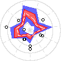
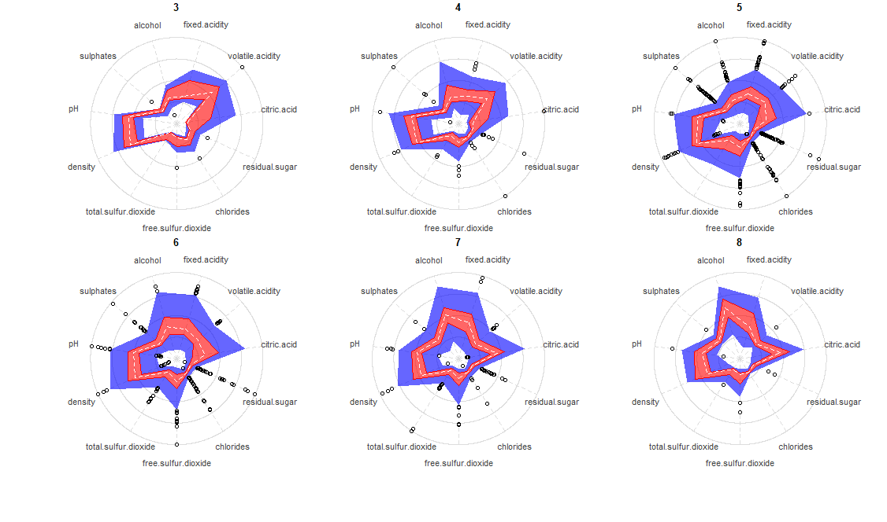

Radar-Boxplot 
===============================================================
[](https://CRAN.R-project.org/package=radarBoxplot)

 


This package provides the implementation of the radar-boxplot, a chart created and developed by the author.

## Installation

The package is available in the CRAN repository.

```r
install.packages("radarBoxplot")
```

## Usage

There are two variants `Default` and `Formula` that accepts two different sets of arguments as input. 

### Default
 - `x`: numerical data frame or matrix of quantitative variables/ordinal categorical variables.
 - `y`: vector of labels/factors 

### Formula
 - `x`: formula describing the relationship between the categorical target variable and the descriptive numerical variables.
 - `data`: the data frame which the formula refers to.
 
### Additional optional arguments
 - `IQR`: numeric. The factor to multiply the IQR to define the outlier threshold. Default 1.5
 - `use.ggplot2`: if ggplot2 is available it will use ggplot for plotting: Default FALSE
 - `mfrow`: mfrow argument for defining the subplots nrows and ncols: Default will calculate the minimum square
 - `oma`: outer margins of the subplots: Default c(5,4,0,0) + 0.1
 - `mar`: margins of the subplots: Default c(0,0,1,1) + 0.1
 - `innerPolygon`: a list of optional arguments to override Q2-Q3 `graphics::polygon()` style: Default list()
 - `outerPolygon`: a list of optional arguments to override the outer (range) `graphics::polygon()` default style: Default list()
 - `innerBorder`: a list of optional arguments to override the inner border `graphics::lines()` default style: Default list()
 - `outerBorder`: a list of optional arguments to override the outer border `graphics::lines()` default style: Default list()
 - `medianLine`: a list of optional arguments to override the median line `graphics::lines()` default style: Default list()
 - `outlierPoints`: a list of optional arguments to override the outliers `graphics::points()` default style: Default list()
 - `nTicks`: number of ticks for the radar chart: Default 4
 - `ticksArgs`: a list of optional arguments to override radar ticks `graphics::lines()` default style: Default list()
 - `axisArgs`: a list of optional arguments to override radar axis `graphics::lines()` default style: Default list()
 - `labelsArgs`: a list of optional arguments to override labels `graphics::text()` default style: Default list()
 - `angleOffset`: offset for rotating the plots: Default will let the top free of axis to avoid its label overlapping the title


## Description

The radar-boxplot merges the concepts of both radar chart and the boxplot, allowing to compare multivariate data for multiple classes/clusters at the same time. It provides an intuitive understanding over the data by creating radar polygons which can be compared in terms of shape and thickness, giving a meaningful insight towards identifying high inner variation and similar classes/clusters.

By interpreting the radar-boxplot, it is possible to predict classification confusion over classes and understand why and what could be done to achieve better results.


## How it works

The plot consists of a polar plot with radius 1. The circunference is divided into `n` axes, where `n` is the number of attributes which will be represented, one for each axis. The attributes are normalized to range from 0.1-1.0 to avoid overlapping low values in the center of the plot. The normalization is done through `normalized = (X - min) / (max - min)`, then it is transformed to 0.1-1.0 range through `rescaled_norm = (normalized * 0.9) + 0.1`.

The radar-boxplot draws two different colored regions representing the same a boxplot would, but for multiple attributes at once. The inner red region represents the 25-75% percentiles of each attribute, while the blue area represents the total range, excluding the outliers as defined by [Tukey (1977)](https://amstat.tandfonline.com/doi/abs/10.1080/00031305.1978.10479236). Outliers appears as points, just like the classic boxplot and are defined with the formulas:

<p align="center">
IQR = Q3 - Q1
<br/>
LOWER_OUTLIER = Q1 - (1.5 x IQR)
<br/>
UPPER_OUTLIER = Q3 + (1.5 x IQR)
</p>

The following shows an example of the radar-boxplot over the Wine Quality Dataset [(Cortez et al., 2009)](https://archive.ics.uci.edu/ml/datasets/wine+quality).



As the rating gets higher there are two different things happening. First, there is a shift on the overall shape, mainly getting a more defined "pointy" shape towards citric acid and alcohol, while concave for volatile acidity. The second interesting fact is that the inner variation appears to reduce, suggesting that top quality wines must conform to a stricter set of parameters, while intermediante ones can have a mixture of poor properties along with high quality ones compensating each other. I could also propose a cluster analysis within ratings 5 and 6 (because of the high inner variation) to try to understand if there are multiple patterns within them, which could reveal different sets of intermediate wines.

The radar-boxplot is best suited for when there are more than 4 relevant variables for your clustering/classification task, because it gives the possibility to represent higher dimensionality while still being readable.


## Example

```r
library(radarBoxplot)
data("winequality_red")

# Regular
radarBoxplot(quality ~ ., winequality_red)

# Orange and green pattern with white median
orange = "#FFA500CC"
green = rgb(0, .7, 0, 0.6)
radarBoxplot(quality ~ ., winequality_red,
             use.ggplot2=FALSE, medianLine=list(col="white"),
             innerPolygon=list(col=orange),
             outerPolygon=list(col=green))


# Plot in 2 rows and 3 columns
# change columns order (clockwise)
radarBoxplot(quality ~ volatile.acidity + citric.acid +
             residual.sugar + fixed.acidity + chlorides +
             free.sulfur.dioxide + total.sulfur.dioxide +
             density + pH + sulphates + alcohol,
             data = winequality_red,
             mfrow=c(2,3))
```

## Acknowledgments

Thanks Dr. Michael Friendly for your great suggestions for improving this package, I'm still working on those. Also, I'd like to thank Dr. Peter Rousseeuw for his valuable feedback.
